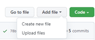
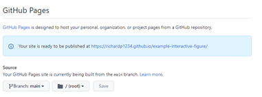

# Example Interactive Figure
Author - Richard Pyle (richard.pyle@bristol.ac.uk)

This guide gives an example of how to create a clickable link to an interactive figure that people can use without installing any code or downloading any data. This can be useful for linking to interactive versions of figures in papers.

This repository contains:
 - index.html - The figure itself
 - CreatingFigure.py - Used to make the example figure. Note that this does not need to be present in the repository for the following steps to work.
 - imgs folder - Contains the screenshots for this README.

## 1.	Making the figure
There are a lot of ways to make an interactive figure. But, for method of getting a shareable link your figure needs to be saved in a .html format.

### Matlab
Default MATLAB does not currently have a way of writing a figure to a .html. Though it looks like people have written and shared code to do this. For example:
 - https://uk.mathworks.com/matlabcentral/fileexchange/32207-matlab-3d-figure-to-3d-x-html
 - https://uk.mathworks.com/matlabcentral/fileexchange/40942-plot-mesh-as-interactive-html

Disclaimer – I have not tested the above code.

### Python
There are quite a few plotting packages in Python. Plotly is a good choice for interactive figures and has an inbuilt ‘write_html’ function.

The Plotly documentation is quite comprehensive: https://plotly.com/python/

[CreatingFigure.py](CreatingFigure.py) contains an example piece of code from the documentation to make an example interactive figure. This figure is written to [index.html](index.html) (it’s important that it’s called index.html).

This .html contains all of the information necessary to plot the figure in a browser (i.e. it does not rely on any data files or .py files). Make sure it does what you expect by double clicking it. It should open in your browser.

## 2.	Setting up a GitHub Repository
A GitHub repository is somewhere to store your figure and other files. It is great for version control. Here we are just using it as a handy way to host the figure.

 - Create a public GitHub repository to store your .html code. This page describes the process - https://docs.github.com/en/get-started/quickstart/create-a-repo
 - Upload index.html to the repository:
 
 
 - It is good practice to upload the data and code used to make the figure so they are in the same place but this is not necessary to link someone to the .html.
 - Give your README.md some useful information.

## 3.	Activating GitHub Pages
GitHub Pages is a free service offered by GitHub that is usually used to host a fancy looking version of your repository. We are going to use it to direct people to the .html figure. To active GitHub pages:
 - Click Settings, then Pages:
 
 - Select ‘main’ as the Source:

 - It should now look like this:
 
   
 - Wait a few minutes for the server to update then click the URL (in this example: https://richardp1234.github.io/example-interactive-figure/). As long as your figure is called index.html the default URL should open the figure.

You can now link this URL to other people (e.g. in papers) to show them your fancy figure. If the file is not called index.html you can put it the file name on the end of the URL to link to it.

## 4. Another Example
Here is another example, from my work:

Figure URL: https://richardp1234.github.io/GFA-Vis/index2.html

GitHub: https://github.com/RichardP1234/GFA-Vis (work in progress!)

